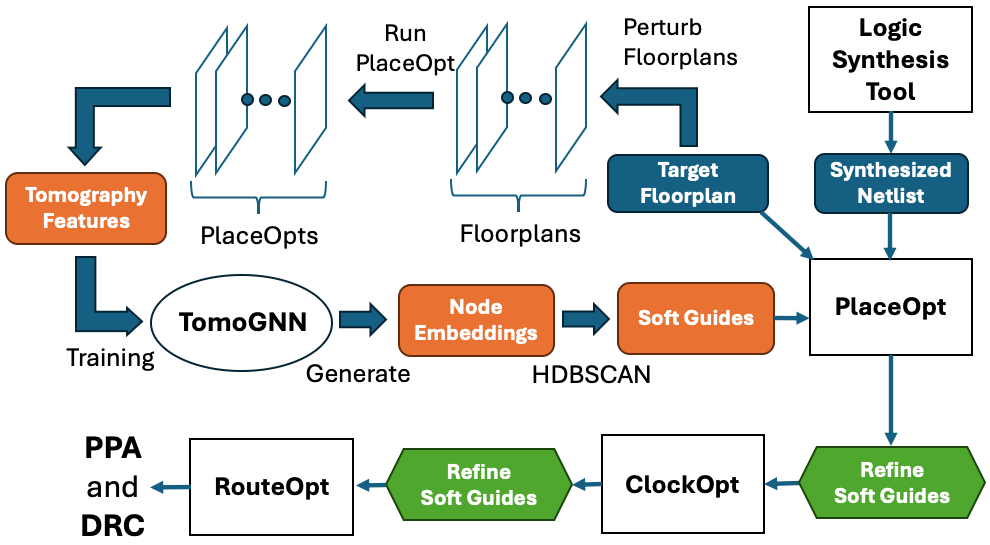

# NetlistTomography

This repository contains the implementation for the paper: **"Netlist
Tomography-Based Soft Guide Generation with Refinement Across P&R Stages
for Improved PPA"**.

## Overview

This codebase provides:

- Complete synthesis and place-and-route (P&R) flows for benchmark designs
- Netlist tomography feature extraction tools
- TomoGNN architecture and training pipeline
- Soft guide generation for P&R tools
- Soft guide refinement algorithms

## Methodology Flow



The figure above illustrates our complete methodology. The following table
maps each component to its implementation in this repository:

| Flow Component | Scripts/Directories | Description |
|----------------|---------------------|-------------|
| **Synthesis & Initial P&R** | `flow/<design>/run.sh`<br>`flow/<design>/run_genus_hybrid.tcl`<br>`flow/<design>/run_invs.tcl` | RTL synthesis and baseline placement & routing |
| **Netlist Tomography** | `scripts/tomo/gen_netlist_tomo.sh`<br>`scripts/tomo/run.sh`<br>`scripts/tomo/syn_map_*.py` | Extract placement-to-synthesis mappings |
| **TomoGNN** | `tomoGNN/main_pipeline.py`<br>`tomoGNN/train.py`<br>`tomoGNN/models/losses.py` | Self-supervised training of tomoGNN<br> with PPA-aware contrastive loss |
| **Soft Guide Generation** | `tomoGNN/utils/cluster_hdbscan.py` | Generate initial soft guides from tomoGNN predictions |
| **Soft Guide Refinement** | `flow/util/optimize_clustering.py`<br>`flow/util/analyze_path_clustering.py` | Refine soft guides using timing criticality and physical location |
| **DEF Generation** | `tomoGNN/generate_def.py`<br>`flow/util/generate_cluster_def.py` | Create soft guide DEF files for P&R tools |
| **P&R with Guides** | `flow/<design>/run_invs.tcl` | Apply soft guides and re-run place & route for improved PPA |

## Directory Structure

```
NetlistTomography/
├── flow/                   # EDA tool flows and testcases
│   ├── ariane/             # Ariane RISC-V CPU design
│   ├── bp_quad/            # BlackParrot quad-core processor
│   ├── jpeg_encoder/       # JPEG encoder accelerator
│   ├── swerv_wrapper/      # SweRV RISC-V core wrapper
│   ├── pdk_ng45/           # NanGate45 PDK files
│   └── util/               # Shared utility scripts
├── scripts/
│   └── tomo/               # Netlist tomography extraction scripts
├── tomoGNN/                # tomoGNN architecture and training pipeline
│   ├── data/               # Graph construction and data loading
│   ├── models/             # tomoGNN architecture
│   └── utils/              # Soft guide generation and sampling utilities
└── paper/                  # LaTeX source for the paper
```

See `flow/README.md` for detailed information about running the EDA
flows.

## Quick Start

### Prerequisites

- **EDA Tools**: Cadence Genus (synthesis) and Innovus (P&R)
- **Python**: 3.8+ with PyTorch and PyTorch Geometric
- **Environment**: Linux with modules support (for tool loading)

### Running the Flow

1. Navigate to a design directory:
   ```bash
   cd flow/ariane
   ```

2. Load required modules:
   ```bash
   module load genus
   module load innovus
   ```

3. Execute the flow:
   ```bash
   bash run.sh
   ```

See `flow/README.md` for detailed instructions.

### Generating Netlist Tomography Features

```bash
cd scripts/tomo
bash gen_netlist_tomo.sh <design_name> <run_directory>
```

### Training tomoGNN Model

```bash
cd tomoGNN
# Setup environment
bash setup_env.sh
# Run training
bash run.sh --config config.py
```

See `tomoGNN/README.md` for detailed training options.

## Dependencies

### EDA Tools
- Cadence Genus (synthesis)
- Cadence Innovus (place and route)

### Python Packages
See `tomoGNN/requirements.txt` for the complete list. Key dependencies:
- PyTorch >= 1.10
- PyTorch Geometric >= 2.0
- NetworkX
- NumPy, Pandas
- scikit-learn
- HDBSCAN, Leidenalg

### PDK
The flows use NanGate45 open-source PDK (included in `flow/pdk_ng45/`).

## License

This project is licensed under the BSD 3-Clause License - see the
LICENSE file for details.
